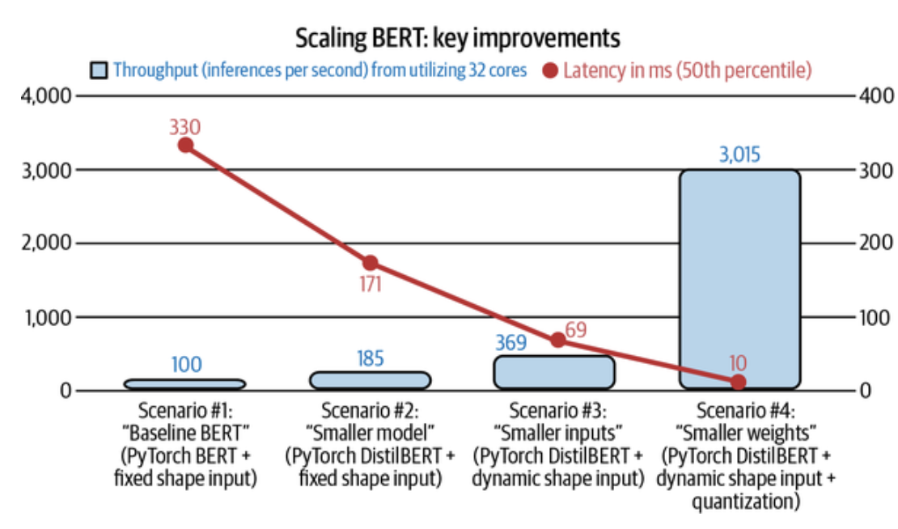

# Designing Machine Learning Systems: Model Comparison (Low-Rank Factorization, Knowledge Distillation, Pruning, & Quantization)

 

### Model Comparison

When deploying a machine learning model, especially in **online prediction systems**, **latency matters**. The quicker a model can produce predictions, the better the user experience (and sometimes even the difference between success and failure, e.g., *in fraud detection or autonomous driving*).

If your model is **too large** or **too slow**, you have three main options:

- **Inference Optimization**: makes it compute faster
- **Model Compression**: makes the model smaller
- **Hardware Acceleration**: uses faster hardware

In this section, we focus on **Model Compression** — reducing the **size and complexity** of a model. Hence, it uses <u>less memory, runs faster, and sometimes even consumes less power</u> (which is crucial for edge devices like smartphones and IoT sensors).

 

### Four Major Techniques in Model Compression

#### 1. **Low-Rank Factorization**

- **Core idea**: Replace large, high-dimensional tensors (arrays of numbers used in neural networks) with <u>lower-rank approximations.</u>
- Example: Replace standard 3×3 convolutions with a **combination of smaller convolutions**, like 1×1.
  - **SqueezeNet**: 50× fewer parameters than AlexNet but with similar performance.
  - **MobileNet**: Replaces standard ($K \times K \times C$) convolution with ($K$ being the kernel size and $C$ being the number of channels: 
    - **Depthwise convolution**: Applies one filter per input channel. ($K \times K \times 1$)
    - **Pointwise convolution**: 1×1 convolution to combine the outputs. ($1 \times 1 \times C$)
  - This leads to massive **parameter savings** and **speedup**, especially in convolutional models.
- **Limitation**: Requires <u>architecture-specific</u> knowledge and is mostly <u>useful for CNNs</u> (Convolutional Neural Networks).

#### 2. **Knowledge Distillation**

- **Core idea**: <u>Train a smaller "student" model</u> to **imitate** the behavior of a large "teacher" model.
- The teacher model is typically large and accurate; the student is small and fast.
  - **DistilBERT**: 40% smaller than BERT, 60% faster inference, 97% of performance retained.
- **Pros**:
  - Student model can have a ***different architecture from the teacher.***
  - Useful for **deploying small models** when high performance is still needed.
- **Cons**:
  - <u>Requires a <b>pretrained teacher model</b>.</u>
  - If a teacher doesn't exist, you must train one first, which is **resource-intensive**.

#### 3. **Pruning**

- **Core idea**: Identify and <u><b>remove less important parameters</b> in a neural network.</u>

##### Two Types of Pruning:

1. **Structural Pruning**:
   - Removes entire nodes/layers (changes the architecture).
2. **Unstructured Pruning**:
   - Sets less important weights to **zero**, making the network sparse (doesn't change the architecture).

- **Effect**:
  - <u>Reduces <b>storage</b> and sometimes **computational** load.</u>
  - <u>Sparse models (with many zero weights) require <b>less memory</b> and <b>faster computation</b> on supported hardware.</u>

- Caveat: Some researchers argue that pruning is effective **not because of the surviving weights**, but because the resulting architecture is inherently better and should be retrained from scratch.

#### 4. **Quantization**

> **Quantization** is the most general and commonly used model compression method. It’s <u>straightforward to do and generalizes over tasks and architectures.</u>

- **Core idea**: Use **lower precision numbers** (fewer bits) to represent weights and activations.

#### Example:

- Standard floating-point (float32) = 32 bits
- <u><b>Half-precision float (float16)</b> = 16 bits → Half the memory</u>
- **Integer (int8)** = 8 bits → 4× smaller than float32

> In extreme cases: use 1-bit quantization (Binary Neural Networks)

- **Pros**:
  - Major reduction in **memory footprint**
  - Faster **inference speed** (simpler math)
  - Enables **larger batch sizes**
- **Cons**:
  - Reduced precision introduces **rounding errors**
  - Risk of **overflow/underflow**
  - Requires **careful scaling & calibration**

- Solution: Use frameworks that support quantization-aware training (QAT) or post-training quantization (PTQ).

##### Quantization in Practice

- **Post-Training Quantization (PTQ)**:
  - Train model normally → then quantize for inference.
- **Quantization-Aware Training (QAT)**:
  - Simulate low-precision training from the start → better final performance.

Recently, low-precision training has become increasingly popular, with support from most modern training hardware.

- NVIDIA introduced Tensor Cores, processing units that support mixed-precision training. 
- Google TPUs (tensor processing units) also support training with Bfloat16 (16-bit Brain Floating Point Format), which the company dubbed “the secret to high performance on Cloud TPUs.”
- Training in fixed-point is not yet as popular but has had a lot of promising results.

 

##### Case Study: Roblox Scaling BERT

- **Problem**: Serve **1+ billion daily requests** with low latency.
- **Baseline**: Full-size BERT model → too slow.

**Optimization Steps:**

1. Replaced BERT with **DistilBERT**
2. Changed input to support **dynamic shapes**
3. **Quantized** the model to int8

**Results:**

    <I>Latency improvement by various model compression methods.  Source: Adapted from an image by Le and Kaehler
</I>  

- **7× latency reduction**
- **8× throughput boost**

> Biggest gains came from **quantization**, which highlights its practical impact in production.

 

### ML on the Cloud and on the Edge

> Another decision you'll want to consider is where your model's computation will happen: on the cloud or on the edge. <u><b>On the cloud</b> means a large chunk of computation is done on the cloud, either public clouds or private clouds.</u> <u><b>On the edge</b> means a large chunk of computation is done on consumer devices-- such as browsers, phones, laptops, etc.</u>

#### Cloud Deploymenst

- **What it is**: Model runs on remote servers ***(AWS, GCP, Azure).***

- **Advantages**:

  - Easy to set up (managed services like SageMaker, Vertex AI).
  - Access to powerful compute (GPUs, TPUs).
  - Centralized model management and versioning.

- **Disadvantages**:

  - **Expensive**: ML inference is **compute-heavy and scales poorly** with usage.

    > Example: <u>Pinterest and Intuit spend hundreds of millions per year on cloud compute.</u>

  - **Network latency**: Sending user data to the cloud, waiting for predictions, and sending results back <u>can take time.</u>

  - **Data privacy**: Transmitting sensitive data increases <u>risk of interception.</u>

  - **Regulatory issues**: Cloud-based systems may violate regulations like GDPR if user data crosses geographic borders.

 

#### Edge Deployment

- **What it is**: Model runs <u>on the end user's device (e.g., phone, smartwatch, camera).</u>
- **Advantages**:
  - **Lower latency**: No network round-trips; prediction happens instantly.
  - **Offline support**: Works in areas with no or poor internet (e.g., rural or secure zones).
  - **Better privacy**: Data stays on the device.
  - **Lower cloud costs**: Less compute usage on centralized infrastructure.
- **Challenges**:
  - Device constraints (memory, CPU, battery).
  - <u>Limited model size and compute budget.</u>
  - Need for specialized optimization and compilation.

To move computation to the edge, the edge devices have to be powerful enough to handle the computation, have enough memory to store ML models and load them into memory, as well as have enough battery or be connected to an energy source to power the application for a reasonable amount of time.

#### Compiling & Optimizing Models for Edge Devices

##### Why Compilation Matters

Every ML framework (TensorFlow, PyTorch) generates high-level code, but each edge device (e.g., ARM chip, custom ASIC) has its own:

- Instruction set (how to run operations),
- Memory layout (L1/L2/L3 caches),
- Compute primitives (CPU = scalar, GPU = vector, TPU = tensor).

Directly translating framework code to hardware-native instructions is hard. So, we use an **intermediate representation (IR)** as a “middleman.”

    <I>Different compute primitives and memory layouts for CPU, GPU, and TPU.  Source: Adapted from an image by Chen et al.</I>  

  
