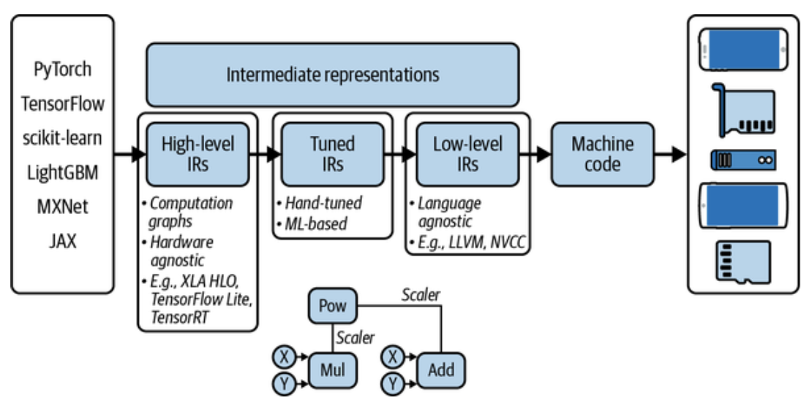
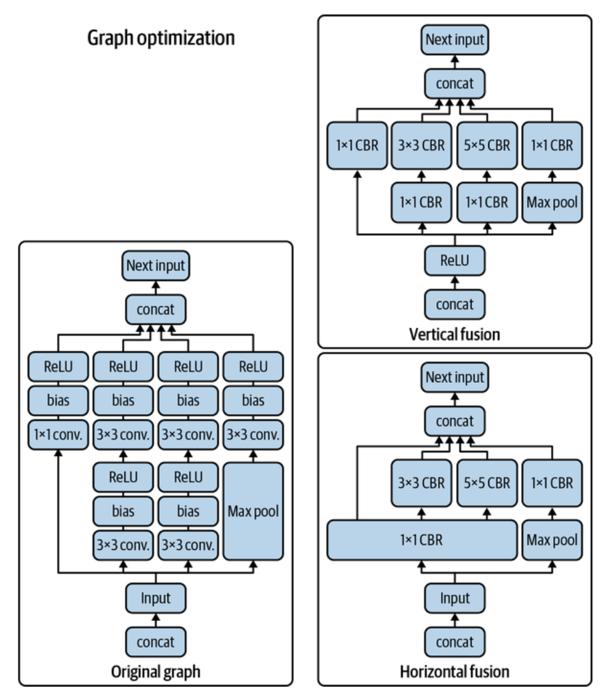

# Designing Machine Learning Systems: ML on the Cloud and on the Edge & Model Optimization (AutoTVM & WebAssembly)

 

###  Compiling & Optimizing Models for Edge Devices

#### Intermediate Representation (IR)

To streamline the process, an **Intermediate Representation (IR)** is used <u>as a middle laye</u>r:

- ML frameworks compile models to IR (like computation graphs),
- Compilers **lower** <u>the IR to low-level machine code suitable for hardware backends</u>.

This separation allows:

- Framework developers to target just one IR,
- And hardware vendors to support one IR instead of many frameworks.

IR acts like a universal “ML bytecode.”

    <I>A series of high- and low-level IRs between the original model code and machine code that can run on a specific hardware backend.
</I>  

This process, called ***lowering***, involves transforming <u>high-level framework code into hardware-native code</u>. It’s not translation, as there’s no one-to-one mapping.

 

#### Model Optimization

Once lowered to hardware-compatible code, **optimization** ensures models run efficiently. Poorly optimized code may work, but it performs terribly.

##### A. Why is optimization hard

- A full ML pipeline encompasses various tools, including `Pandas, NumPy, scikit-learn`, `PyTorch`, etc.
- **<u>These don’t communicate efficiently.</u>** Using a naive method to transfer data between these functions can cause a significant slowdown in the entire workflow.
- Real-world example: *Stanford’s DAWN lab found that such workflows could be **23 times slower** than hand-optimized code.*

##### B. Roles of Optimization Engineers

Some companies hire specialists to optimize code for specific chips (like Mythic or NVIDIA).
 ***But this is expensive***. That’s where **optimizing compilers** come in.

During the process of translating ML model code into machine code, compilers can analyze the computation graph of your ML model and the operators it includes—such as convolution, loops, and cross-entropy—and find ways to make it faster.

 

#### Local vs. Global Optimizations

- **Local optimization** <u>focuses on individual operators (e.g., matrix multiplication).</u>
- **Global optimization** <u>improves the <b>entire computation graph</b> (end-to-end).</u>

##### Common local techniques:

There are standard local optimization techniques known to speed up your model, *most of which involve running processes in parallel or reducing memory access on chips.* 

- **Vectorization**: Execute **<u>multiple loop</u>** elements in parallel.
- **Parallelization**: Split *<u>array tasks into chunks, process in parallel.</u>*
- **Loop tiling**: <u>Restructure loops for better memory cache use.</u>
  - Hardware dependent. An effective access pattern on CPUs may not perform well on GPUs. 
- **Operator fusion**: <u>Combine multiple loops into one to reduce memory overhead.</u>

To achieve a much larger speedup, you need to leverage higher-level structures of your computation graph. For example, a convolutional neural network can be fused either vertically or horizontally to reduce memory access and accelerate the model.

    <I>Vertical and horizontal fusion of the computation graph of a convolutional neural network.  Source: Adapted from an image by the TensorRT team</I>  

#### Using ML to Optimize ML (AutoTVM)

Traditionally, framework and hardware vendors hire optimization engineers who, based on their experience, **develop heuristics to execute the computation graph of a model efficiently.** For example, NVIDIA might have an engineer or a team of engineers dedicated solely to making ResNet-50 run as fast as possible on their DGX A100 server.

Hand-designed heuristics have drawbacks. *They are not optimal, as there's no guarantee that they are the best solution*. They are also not adaptive; applying them to new frameworks or hardware requires significant effort.

If you lack ideas for heuristics, try all ways to run a computation graph, **record their times**, and **pick the best**. But exploring all paths is intractable. Luckily, ML excels at approximating solutions to such problems. 

What if we use ML to reduce the search space by predicting path durations, avoiding the exploration of many paths, and waiting for full computation?

ML-based compilers like **autoTVM** automate this:

- Break the model graph <u>into subgraphs.</u>
- Measure the actual execution time of various strategies.
- Train a **cost model** to predict which strategy will run fastest.

The pro is that the model, trained on runtime data, adapts to any hardware. The con is it takes longer for the cost model to improve. This method adapts to different hardware by learning from **runtime data**. It may take dozens of trials (e.g., ~70 for ResNet-50), but the results yield significant performance boosts.

<b>ML-powered compilers</b> deliver impressive results but can be slow, especially for complex models, as they explore many paths to find optimal solutions. This one-time process can be cached for reuse in optimizing models or initial tuning. You optimize once for a hardware backend and deploy on multiple devices. This approach suits production models targeting a specific hardware for inference.

 

#### Model Deployment in Browsers (WebAssembly)

Another option is compiling your model for the **browser**, using:

- **TensorFlow.js** (JavaScript)
- **WebAssembly (WASM)**

However, *JavaScript is slow, and its capabilities as a programming language are limited for complex logic, such as extracting features from data.* WASM outperforms JavaScript in speed and enables models to run in any browser, regardless of the device's hardware (e.g., iPhones, Chromebooks). You no longer need to worry about Intel versus ARM chips.

After building models in `scikit-learn, PyTorch, TensorFlow,` or other frameworks, you can compile your model to WASM instead of specific hardware. This yields an executable file usable with JavaScript.

WASM is:

- Supported by 93%+ of devices (as of 2021),
- Easy to use,
- Portable.

But it’s not as fast as running models natively. On average, WASM is **45–55% slower** than native apps.

  
