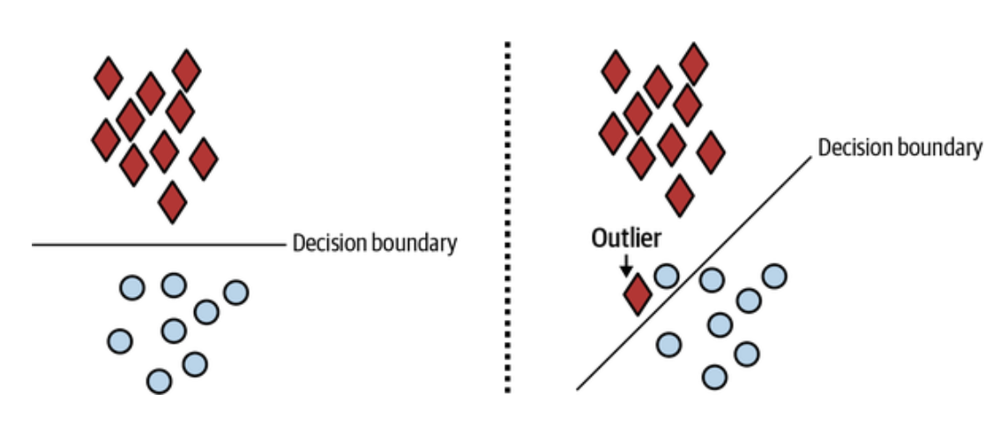

# Designing Machine Learning Systems: Causes of ML System Failures (1) (Production data differing from training data, Edge Cases, and Degenerate Feedback Loops)

 

### Why ML Models Fail in Production

When companies deploy ML systems, they often think the work ends there. However, ***models tend to degrade over time.*** This isn't necessarily because the model was poorly trained, but because the <u><b>real-world data it encounters changes</b> and <b>no longer resembles the training data.</b> This is known as a <b>data distribution shift.</b></u>

A classic example is a grocery chain that had a model to predict item demand. Initially, it worked great. But a year later, it overpredicted some items (leading to waste) and underpredicted others (leading to stockouts). The underlying issue? The model didn’t adapt to changing consumer behavior.

 

#### Types of Failures in ML Systems

Before identifying ML system failures, let’s define what a failure is. <u>It occurs when expectations are violated.</u> Traditional software focuses on operational metrics such as latency and throughput. **ML systems have additional performance metrics, such as accuracy.** For example, an English-French translation system should return a translation within one second (operational) and be accurate 99% of the time (performance). If it doesn’t produce a translation, it’s a failure. <u>If the translation is inaccurate but an error margin exists, it's not a failure. Repeated incorrect translations, however, violate the accuracy expectation and constitute a failure.</u>

ML performance expectation violations are hard to detect **because they require monitoring models in production.** *Many Google Translate errors go unnoticed by users, leading us to say ML systems often fail silently.*

There are two broad categories of failures:

##### 1. Software System Failures

These are traditional failures unrelated to ML, such as:

- **Dependency failures** (e.g., a third-party library breaks)
- **Deployment errors** (e.g., wrong model version deployed)
- **Hardware failures** (e.g., overheating CPUs)
- **Crashes or downtimes** (e.g., server outage)

Just because some failures are not specific to ML doesn’t mean they’re not crucial for ML engineers to understand. Even in Google’s large-scale ML systems, ~60% of failures came from these types of issues. That’s why ML engineering is still very much a form of **software engineering**.

##### 2. ML-Specific Failures

These are unique to machine learning systems and include:

- Poor data quality or preprocessing
- Differences between training and inference pipelines
- Overfitting to training data
- **Data distribution shifts**
- **Edge cases** and **degenerate feedback loops**

 

#### Production data differing from training data

##### Data Distribution Shift

> When an ML model learns from training data, it means that it grasps the underlying data distribution, enabling it to make accurate predictions on unseen data. We’ll explore this mathematically in “**Data Distribution Shifts**.” <u>When the model predicts well on unseen data, it “<b>generalizes to unseen data.” </b></u>

The test data evaluates this performance, representing unseen data and indicating how well the model will generalize.

One of the most essential aspects of ML training is that the training data and <u>the unseen data should come from a similar distribution</u>. The assumption is that *the unseen data originates from a stationary distribution identical to that of the training data.* If the unseen data comes from a **different distribution**, the **model may not generalize effectively.** This assumption is usually **incorrect** because *<u>the real-world data distribution often differs from the training data,</u>* making it challenging to curate a dataset that accurately represents production data. Divergence, such as different emoji encodings, causes ***train-serving skew***—where a model excels in development but performs poorly in deployment.

Second, **<u>the real world isn’t stationary.</u>** *Data distributions shift over time*. In 2019, searches for Wuhan likely sought travel info, but post-COVID-19, they aim to learn about the place where the virus originated. *Models that perform well initially may degrade over time as data changes. Such failures require ongoing monitoring and detection.*

***Data shifts occur suddenly, gradually, or seasonally.*** Sudden changes occur due to events such as *competitors changing prices, launching in new regions, or a celebrity endorsement,* resulting in a surge of users. Gradual shifts occur due to evolving social norms, cultures, languages, trends, and industries. **Seasonal variations** also influence data, such as an increase in ride-share requests during winter.

Real-world data is messy, unbounded, and constantly evolving. ML models need to be **monitored**, **retrained**, or **adapted** to account for these shifts.

 

#### Edge Cases

> Imagine a self-driving car that's safe 99.99% of the time but **could cause a catastrophic accident in 0.01**%, risking permanent injury or death. **Would you use that car?**

An ML model that performs well in most cases but fails in a few might not be practical if those failures lead to catastrophic outcomes. That’s why major self-driving car companies are focusing on addressing edge cases.

**Edge cases** are data samples so extreme that they can cause the model to make serious mistakes. <u>Although edge cases typically refer to <b>data samples</b> from the same distribution, <b>a sudden increase</b> in data samples where your model performs poorly may indicate that the underlying data distribution has shifted.</u>

In ML:

- **Outliers** are rare data points.
- **Edge cases** are <u>where the model performs poorly, even if the data point isn’t rare.</u>

Outliers are data points that differ significantly, while edge cases are situations where a model performs poorly. Sometimes, an outlier triggers a model error, but **not all outliers are edge cases**. For safety-critical systems, edge case robustness is essential. For example, a jaywalking person is an outlier *<u>but not an edge case if detected and responded to correctly by a self-driving car.</u>*

During model development, outliers can negatively impact performance, as illustrated below. Removing them can help the model learn more effective decision boundaries and generalize better. **However, during inference, you can't usually remove outliers, but can transform queries,** like Google suggesting “machine learning" for "mechin learnin." Ultimately, aim for a model that performs well on unexpected inputs.

    <I>The image on the left shows the decision boundary when there’s no outlier.  The image on the right displays the decision boundary with one outlier, which differs significantly from the first case and is likely less accurate.
    </I>

 

#### Degenerate Feedback Loops

From my previous postings, regarding "Natural Labels", we discussed **a feedback loop** from prediction <u>display to feedback provision.</u> *This feedback helps extract natural labels for evaluating and training the model.*

> A **degenerate feedback loop** occurs when a system’s outputs **influence its future inputs, affecting the next iteration's outputs.** In machine learning, predictions can shape user interactions, and if these interactions are used as training data, it can lead to unintended consequences.

They are especially common in tasks *involving natural labels from users, such as recommender systems and ad click-through-rate prediction.*

Imagine a system that recommends songs, where top-ranked songs appear at the top, leading to more clicks and higher rankings. **Slight differences initially cause popular items to dominate, creating feedback loops.** This phenomenon, known as *"exposure bias," "popularity bias," "filter bubbles," or "echo chambers,"* explains <u>why popular items remain popular and new ones struggle to emerge.</u> It is a common, well-studied issue in production environments.

- A recommendation system shows only popular items.
- Users click those items (since that’s all they see)
- The system learns that those items are “better”
- Less popular items never get surfaced.

Over time, the model becomes **less diverse and more biased.**

This creates a **self-reinforcing bias** that reduces content diversity, penalizes lesser-known items, and fosters a **“rich-get-richer”** effect.

 

##### How to Detect Degenerate Feedback Loops

###### Step 1: Measure Popularity Diversity (Offline)

> When a system is **offline**, <u>degenerate feedback loops are difficult to detect.</u> Degenerate loops result from user feedback, and a system won’t have users until it’s online (i.e., deployed to users). 

Even before deploying your model, you can check if it’s biased toward popular items.

- **Item popularity** = how many times the item has been interacted with historically (e.g., clicked, liked, viewed).
- Most item popularity follows a **long-tail distribution**, <u>where few items are extremely popular, while most are rarely seen.</u>

Other metrics you can use:

- **Aggregate diversity**: total number of unique items recommended.
- **Average coverage** of long-tail items: How many less-popular items are included in top-K recommendations across users?

Low scores indicate that y**<u>our system's outputs are simila</u>**r, which may be caused by ***popularity bias.***

 

###### Step 2: Measure Accuracy by Popularity Bucket (Offline or Online)

**Proposed by Chia et al. (2021)**:

1. Split items into buckets based on popularity:
   - Bucket 1: Items < 100 interactions
   - Bucket 2: 100–1,000 interactions
   - Bucket 3: >1,000 interactions
2. Measure **hit rate** (or prediction accuracy) <u>for each bucket.</u>
3. If your model performs **much better on popular items**, it isn’t very objective.

- **Warning sign**: High accuracy ***only on popular items*** indicates <u>risk of degenerate loop.</u>

 

###### Step 3: Watch for Homogenization in Production (Online)

Once deployed, monitor:

- **Diversity of shown items** over time
- **Repeated items** across sessions
- The user clicks on the top items.

If your system’s *outputs become increasingly similar, and fewer unique items are being clicked or shown*, it’s likely caught in a **degenerate loop**.

