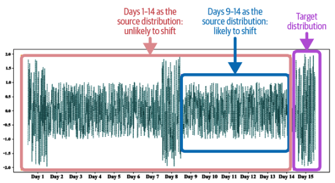
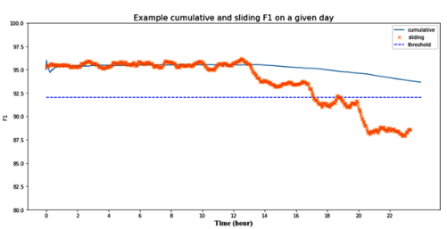

# Designing Machine Learning Systems: Data Distribution Shifts (2) (Detecting & Addressing Data Distribution Shifts)

 

### Detecting Data Distribution Shifts

Data distribution shifts are only problematic if they cause a decline in your model’s performance. Monitor **accuracy, F1 score, recall, AUC-ROC,** and other key metrics in production to detect any changes. “**Change**" usually means “*<u>decrease</u>*,” but if accuracy *<u>suddenly</u>* increases or *<u>fluctuates</u>* for no reason, investigate.

> Caveat: Labels often arrive late (due to delayed supervision) or not at all.

#### When Labels Are Unavailable or Delayed

Accuracy-related metrics compare model predictions to **ground truth labels.** During development, labels are available, but in production, they are often unavailable or delayed, as discussed in “Natural Labels”. **Having timely labels improves visibility into performance.** When labels are unavailable or delayed, <u>monitoring other distributions is useful.</u> 

In such cases, monitor the **distributional properties** of:

- $P(X)$: Input distribution (available immediately)
  - ***Most drift detection methods focus on** identifying changes in input distributions, particularly in feature distributions, as discussed in this context.*
- $P(Y)$, $P(Y\vert X)$, $P(X\vert Y)$: Require ground truth—trickier to access

 

#### Statistical Methods for Detecting Shifts

##### 1. Summary Statistics

- **Compare** their statistics, *such as minimum, maximum, mean, median, variance, various quantiles (like the 5th, 25th, 75th, or 95th percentile), skewness, kurtosis, and more.*
  - For example, you can compute the median and variance of a feature during inference and compare them to training metrics.
- **Pros**: 
  - Simple and fast
  - Easy to implement 
- **Cons**:
  - Ineffective for **non-Gaussian** or **multi-modal** distributions
    - If metrics differ significantly, the inference distribution might have shifted; if similar, there’s no guarantee that no shift occurred.
  - Can <u><b>miss subtle but essential shifts</b></u>

 

##### 2. Two-Sample Hypothesis Testing

A more principled way to assess whether two datasets are from the same distribution.

> A test to assess whether the difference between two populations (or data sets) is statistically significant.

If the difference is statistically significant, the probability that it's due to random sampling is very low, indicating that the t**wo populations come from different distributions**. *<u>If data from yesterday (source) and today (target) are statistically different, the underlying data distribution has likely shifted.</u>*

A caveat is that a statistically significant difference *may not be important*. However, *if you can detect a difference with a small sample, it's likely serious;* if it requires many samples, it's probably not worth concern.

Let:

- Source (e.g., training) = $D_s$
- Target (e.g., production) = $D_t$

Test: Is $D_s = D_t$?

##### Key Tests:

| Test                                        | Description                                     | Strengths                              | Limitations                                    |
| ------------------------------------------- | ----------------------------------------------- | -------------------------------------- | ---------------------------------------------- |
| **Kolmogorov-Smirnov (KS) Test**            | Non-parametric test for 1D distributions        | Simple, assumption-free                | Only works on **1D features**, false positives |
| **Maximum Mean Discrepancy (MMD)**          | Kernel-based test for **high-dimensional** data | Works well in theory                   | Less used in industry due to complexity        |
| **Least-Squares Density Difference (LSDD)** | Directly estimates density difference           | More robust for multi-dimensional data | Still relatively underused                     |

Since **two-sample tests** tend *to perform better with low-dimensional data than with high-dimensional data*, it is highly advised that <u>you reduce the data's dimensionality before conducting a two-sample test.</u>

- **Heuristic**: If a test detects a significant difference with a small sample, the drift is probably **meaningful**.

Statistical tests degrade in high dimensions due to the curse of dimensionality and sparse support overlap.  <u>Solution: Use dimensionality reduction techniques such as PCA, t-SNE, or UMAP before applying statistical tests.</u>

 

#### Time-Based Considerations

Not all types of shifts are the same—<u>some are harder to detect than others.</u> *For instance, shifts occur at **different speeds**, and sudden changes are more noticeable than slow, gradual ones. Shifts can also **happen across two dimensions**: spatial or temporal.*

- Data evolves → **Temporal Drift**.
- Data varies by source → **Spatial Drift**.

##### Temporal Shifts:

    <I>Whether a distribution has shifted over time depends on the specified time scale window.</I>  

When dealing with temporal shifts, **the time scale** window of the data we analyze influences the shifts we can identify. If your data has a *weekly cycle*, <u>then a time scale of less than a week won’t detect the cycle.</u>

Using data from days 9 to 14 makes day 15 seem shifted, **<u>but using days 1 to 14 shows all data points are from the same distribution</u>**. Detecting shifts is difficult when seasonal variation confounds it. 

- Looks like a time series problem.
- Changes may be:
  - **Abrupt** (easy to detect)
  - **Gradual** (harder, masked by seasonality)

##### Time Window Design: Sliding vs. Cumulative

| Starategy          | Discription                                        | Pros                            | Cons                      |
| ------------------ | -------------------------------------------------- | ------------------------------- | ------------------------- |
| **Sliding Window** | Evaluate on recent, rolling windows (e.g., 1 hour) | Detect **short-term anomalies** | Can be noisy              |
| **Cumulative**     | Aggregate all past data up to the current time     | Stable view                     | Can **hide sudden drops** |

- Example: <u>Cumulative accuracy may miss a sudden drop in model performance from 4 PM to 6 PM.</u>

    <I>Cumulative accuracy hides the sudden dip in accuracy between hours 16 and 18. <a href="https://madewithml.com/courses/mlops/monitoring/"> Source: Adapted from an image by Goku Mohandas</a>  </I>

### Addressing Data Distribution Shifts

> How companies handle data shifts depends on **how advanced their ML infrastructure is**. On one end, there are companies just starting with ML and still working on deploying models into production, so they might not yet face serious problems from data shifts. However, in the future—perhaps three or six months—t**hey may find that their initially deployed models have degraded to the point where they cause more harm than good.** At that point, they will need to update their models to handle shifted data distributions or replace them with other solutions. 

Many companies believe data shifts are unavoidable, leading them to retrain their models regularly—monthly, weekly, or daily—**without considering whether it's necessary**. <u>Deciding the best retraining frequency is crucial, yet many companies rely on intuition rather than experimental evidence to make this choice.</u> 

#### Three Main Approaches

##### 1. Train on Massive, Diverse Datasets

- Goal: Learn from *everything* so your model generalizes well.
- Limitation: May not cover rare cases, may be expensive, and data-intensive.

##### 2. Domain Adaptation (No Labels from Target) -- Less popular

- Goal: Adapt models without needing labels in the new (shifted) domain.

- Key Methods:
  - **Kernel embedding** of conditional distributions (Zhang et al., 2013)
  - **Domain-invariant representation learning** (Zhao et al., 2020)
-  Industry Limitation: Still in research—**rarely adopted in production**.

##### 3. Retrain Your Model (Most Common in Industry)

However, retraining your model is not simple. It can involve either **retraining the model from scratch** using both the old and new data or c**ontinuing training the current model on new data.** The latter is also known as *fine-tuning.*

Two questions to answer:

**1. Stateless vs. Stateful Training**

- **Stateless**: Train from scratch
- **Stateful**: Continue training from the last checkpoint (fine-tuning)

**2. Which Data?**

- *Last 24 hours?*
- *Last 1 week?*
- *Since when has it been detected?*
- *Last 6 months?*

-- Requires experimentation to find the **best retraining window**.

Readers familiar with data shift literature often see data shifts alongside **domain adaptation** and **transfer learning**. If a distribution is considered a **domain**, then adapting a model to a new distribution is similar to adapting it to different domains. Similarly, if you view learning a **joint distribution $P(X, Y)$ as a task**, then adapting a model trained on one joint distribution for another can be seen as a type of transfer learning. With transfer learning, you don’t re-train the base model for a second task, but adapting to a new distribution may require retraining from scratch.

 

Addressing data distribution shifts doesn’t need to start after they occur. You can design your system to be **more resilient** against shifts. **Features can change at different rates. ** *For example, when predicting if a user will download an app, using app store ranking makes sense since higher-ranked apps are downloaded more.* However, **rankings can change rapidly.** You could **bucket rankings into broad categories like top 10, 11-100, etc**. App categories might change less often but may also be less predictive. <u>When choosing features, weigh the trade-off between performance and stability: a feature might be highly accurate but degrade quickly, requiring more retraining.</u>

Design your system to adapt to changes, such as faster housing price shifts in cities like San Francisco versus rural Arizona, by **using separate models for each market**. <u>Updating a single model for both markets requires data from both to meet San Francisco’s update rate, while separate models allow updates only when needed.</u>

Remember, not all production model issues stem from ML; many are human errors. If human errors cause failure, identify and fix them first. Detecting data shifts is challenging, and understanding their cause can be even harder.

 

##### Side Note: Designing for Robustness to Shifts

Even before shifts happen, **anticipate them**:

##### Feature Stability vs. Performance Trade-off

| Feature      | Predictive Power | Shift Rate | Strategy                      |
| ------------ | ---------------- | ---------- | ----------------------------- |
| App Ranking  | High             | High       | Bucket into coarse categories |
| App Category | Medium           | Low        | More stable                   |

Choose features with **predictive power AND temporal stability**.

  
