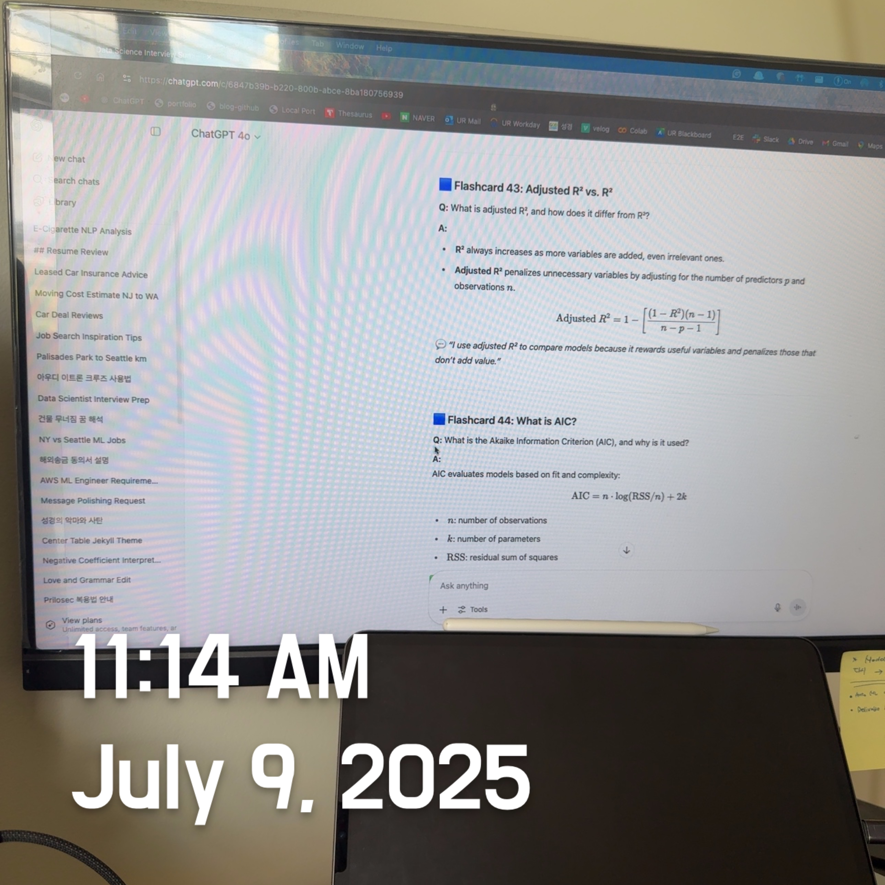
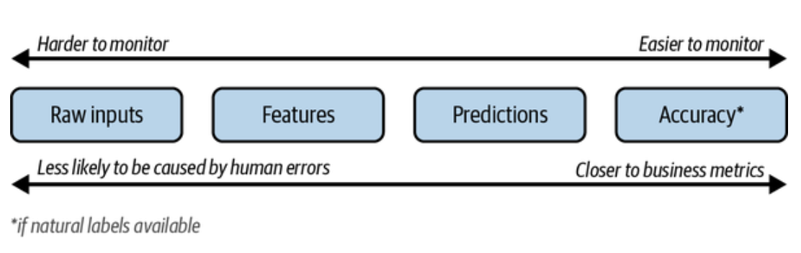
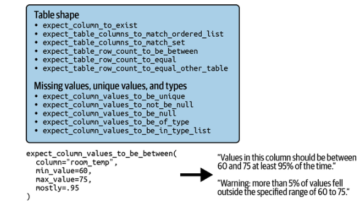

# Designing Machine Learning Systems: Data Distribution Shifts (3) (Understanding Failures: Monitoring and Observability for ML System Reliability)



<br>

## Monitoring and Observability

As the industry realized that many things can go wrong with an ML system, many companies started investing in monitoring and observability for their ML systems in production.

> Monitoring and observability are sometimes used interchangeably, **but they are different**. **Monitoring** involves **tracking, measuring, and logging** various metrics that can help identify when something goes wrong. **Observability** refers to **configuring our system to provide visibility into its inner workings, aiding us in investigating issues.** This setup process is also called “<u>instrumentation.</u>” Examples of instrumentation include adding timers to functions, counting NaNs in features, tracking how inputs are transformed, logging unusual events like exceptionally long inputs, and so on. Observability is a component of monitoring. Without some degree of observability, monitoring cannot be effectively performed.

Monitoring is **<u>all about metrics.</u>** Because ML systems are software, the first type of metrics you should track is operational metrics. These metrics are meant to show the health of your systems. They are usually organized into three levels: the network the system runs on, the machine hosting the system, and the application that the system executes. 

**Availability** is a key characteristic of production software, measured by uptime and defined by <u><b>SLAs</b> or <b>SLOs</b></u>. *For instance, an SLA might specify that the service is up if latency is under <u>200 ms median</u> and <u>2 s at the 99th percentile.</u>* Providers like AWS guarantee 99.99% uptime, offering service credits if unmet. <u>However, for ML systems, system health also depends on model performance—if predictions are poor, <b>user satisfaction drops,</b> so ML-specific metrics are essential.</u>

**Observability** is the **ability to understand the internal state** of a complex system **purely by examining its outputs**, like logs, traces, and metrics.

It’s a **proactive design principle**—you design the system to be debuggable without needing to change the code or rerun experiments. Key Goals are <u>to help identify where and why something broke, enable root cause analysis, and provide context-rich traces to go from symptoms to source.</u>

<br>


### ML-Specific Metrics

Within ML-specific metrics, there are typically ***four artifacts to monitor***: a model’s accuracy-related metrics, predictions, features, and raw inputs. 

A. **Operational Monitoring** (Standard software metrics)

- Uptime/downtime
- Latency (e.g., time to predict)
- Throughput (e.g., # of predictions/sec)
- Resource usage (CPU, GPU, RAM, Disk)
- Errors (e.g., 5xx responses, timeouts)

B. **ML-Specific Monitoring** (Domain-specific metrics)

- Prediction accuracy (e.g., precision, recall, F1 score)
- Data drift/feature drift
- Model drift/concept drift
- Output distribution (e.g., % of classes predicted)
- Feedback (clicks, ratings, conversions)

These artifacts are generated at four different stages of an ML system pipeline, as illustrated in the figure below. ***The farther an artifact is into the pipeline, the more transformations it has undergone***, <u>which increases the likelihood that changes in that artifact are caused by errors in one of those transformations.</u> *However, the more transformations an artifact has experienced, the more structured it becomes and the closer it is to the metrics you actually care about, making it easier to monitor.* 

<center>
  <br><br><I>The more transformations an artifact experiences,<br> the more likely its changes are due to errors in one of those transformations.</I><br><br>
</center>

#### 1. Monitoring Accuracy-Related Metrics

Accuracy-related metrics are the most straightforward way to determine if a model’s performance has declined. Even if the feedback can’t directly reveal natural labels, it can still be used to identify changes in your ML model’s performance.

For example, when we build a YouTube video recommendation system, we track **not only click-through rate but also watch time** and **whether users finish videos**. If click-through stays constant but completion drops, it may indicate system deterioration.

It is also possible to engineer the system to collect feedback, like Google Translate's upvote/downvote system. A rise in downvotes may indicate issues. These can **guide labeling, prompting experts** to improve translation <u>for better future models.</u>

#### 1) Monitoring Predictions

Prediction is the most common artifact to monitor. *For regression tasks, each prediction is a continuous value, like a house price, while for classification, it's a discrete category*. Predictions are usually just numbers, **making them easy to visualize and interpret.** 

You can **track distribution shifts** by <u>running two-sample tests on predictions</u>, which are low-dimensional. Predictions also indicate **input shifts**: *if the model's function mapping input to output remains the same, then a change in prediction distribution signals a shift in input distribution.* 

You can also **monitor predictions for anything unusual**, such as an abnormal number of False results in a row. There might be a long delay <u>between predictions and ground truth labels</u>. Changes in accuracy metrics might not be noticeable for days or weeks, whereas a model predicting all False over 10 minutes can be detected right away. 

#### 2) Monitoring features

ML monitoring solutions focus on **tracking feature changes**, <u>including inputs and transformations from raw data to final features</u>. Feature monitoring is attractive because features are well-structured compared to raw data.

The first step of feature monitoring is **<u>feature validation</u>**: ensuring that features <u>follow an expected schema, usually generated from training data or common sense.</u> Violations in production may indicate a shift in distribution.

For example, here are some of the things you can check for a given feature:

- If the min, max, or median values of a feature are within an acceptable range
- If the values of a feature satisfy a regular expression format
- If all the values of a feature belong to a predefined set
- If the values of a feature are always greater than the values of another feature

Feature validation, also called **table testing,** <u>involves checking features organized in tables where columns are features and rows are data samples.</u> Many open source libraries assist with basic feature validation, with the two most popular being **Great Expectations** and **Deequ**, which AWS develops. <u>The figure below illustrates some of the built-in feature validation functions in Great Expectations and provides an example of how to use them.</u>

<center>
  <br><br>
</center>


In addition to basic feature validation, you can also **use two-sample tests** <u>to determine whether the underlying distribution of a feature or a set of features has changed.</u> Because a feature or a set of features can be high-dimensional, you might need to reduce their dimensions before performing the test, which can make the test less effective.

There are four major concerns when doing feature monitoring:

- A company might have hundreds of models, each using hundreds or thousands of features.

  - Computing hourly summary statistics for many features is costly in terms of computing and memory. T**racking too many metrics constantly can slow your system,** increase latency for users, and delay anomaly detection.

- While tracking features help with debugging, **they’re not very effective for detecting model performance degradation.**

  - A slight distribution shift can cause failure, **but minor feature changes may not harm performance**. Feature distributions often change harmlessly, *<u>causing many false alerts</u>*. <u>This "alert fatigue" can make teams ignore alerts, making it crucial to identify critical feature shifts.</u>

- Feature extraction often involves **multiple steps, such as filling missing values and standardization, using libraries such as `pandas` and Spark across services like BigQuery or Snowflake.

  - You may have a relational database as input and a NumPy array as output for feature extraction. **Detecting harmful changes in a feature might not reveal if they result <u>from an input shift or a processing error.</u>**

- The schema that your features follow can change over time.

  - If you don't version **schemas** and map features to expected schemas, **the alert may be caused by a schema mismatch, not data change.** 

  

These concerns don't dismiss feature monitoring's importance; changes in feature space are useful signals for understanding ML system health. <u>Considering these can help you select a suitable feature monitoring solution.</u>


#### 3) Monitoring Raw Inputs

A change in features might stem **from processing issues rather than data changes**. Monitoring raw inputs before processing can be tricky due to multiple sources in different formats and limited access for ML engineers, who typically query already processed data stored by the data platform team. Consequently**, raw input monitoring is usually the data platform team's responsibility, outside this book's scope.**

<br>

### Monitoring Toolbox

>Traditional monitoring is essential but insufficient for today’s complex ML pipelines. Engineers rely on **logs**, **dashboards**, and **alerts** to track what is happening. The goal is to **detect**, **understand**, and eventually **respond** to issues.

However, as systems scale (e.g., microservices, serverless, cloud-native architectures), **monitoring evolves into “observability,”** a more powerful concept for understanding a system’s internal behavior via its external signals.

#### 1. Logs

Logs are **timestamped records of events** that happen inside the system at runtime. These can include:

- When a container starts or stops
- Memory usage, errors, warnings
- Function inputs/outputs
- Model predictions
- Tracebacks for exceptions
- User requests and system responses

> **“If it moves, we track it.”** — This principle underscores the exhaustive tracking approach at companies like Etsy.

Logs are useful for several reasons: they help debug unexpected behaviors, record ground truth for auditing and compliance, act as a source of derived metrics and traces, and enable root-cause analysis in distributed systems.

Modern challenges include scale and complexity. Large systems generate billions of events daily, such as Badoo, which handled approximately 20 billion events per day in 2019. Additionally, complexity arises when a single user request can trigger 20–30 service hops, making it difficult to identify the exact point of failure even if the timing is known.

- Best Practices: Attach unique trace/request IDs to track the journey of a request across services, include rich metadata (e.g., service name, function, user, model version, inputs), and use structured logging (e.g., JSON format) for easy parsing and querying.
- Real-World Tools
  - **Log aggregation**: ELK stack (Elasticsearch + Logstash + Kibana), Fluentd
  - **Real-time pipelines**: Kafka, Kinesis
  - **Log analysis**: Spark, Hadoop, Flink SQL, KSQL

##### ML in Logs

- **Anomaly detection**: Identify abnormal logs that deviate from expected patterns
- **Failure prediction**: Estimate which services may also fail due to upstream issues
- **Priority classification**: Label logs as usual, warning, error, fatal, etc.

<br>

#### 2. Dashboards

> Dashboards visualize metrics in real time or over time. This helps humans **quickly spot trends, anomalies, or patterns**.

- Why They Matter: Make monitoring accessible to engineers and non-engineers (PMs, analysts), convert raw logs and metrics into actionable visuals, and support decision-making (e.g., "is this drift temporary or persistent?").
- Common Pitfalls: Graphs do not necessarily equate to understanding; a noisy or spiky loss graph may lead to confusion rather than clarity. Additionally, dashboard rot occurs when it is cluttered with too many outdated or low-signal panels, reducing its effectiveness.
- Best Practices
  - Visualize **aggregated and relevant metrics.**
  - Build **task-specific dashboards** (e.g., “inference health”, “training accuracy”, “model drift”)
  - Use **color coding**, **threshold alerts**, and **annotations** (e.g., when a new model was deployed)

<br>

#### 3. Alerts

> Alerts are **automated notifications** when the system detects that something suspicious, risky, or wrong is happening.

- Components of an Alert
  - **Alert Policy**: Defines what triggers an alert (e.g., “accuracy < 90% for 10 minutes”)
  - **Notification Channels**: Where the alert is sent (e.g., Slack, PagerDuty, Email)
  - **Description/Runbook**: A helpful explanation of the alert with possible mitigation steps

- Example

```markdown
## 🚨 Recommender Model Accuracy Below 90%
Time: 2025-06-30 13:45 UTC  
Model: v5.2  
Service: inference-api-prod  
Suggested Action: Check data drift on user_age and content_type  
Dashboard: [Click here](http://grafana.mlteam.ai/recmodel-prod)
```

<br>

#### Alert Fatigue

- Caused by **too many trivial alerts**
- Can lead to **critical ones being ignored**
- Solutions:
  - Set **meaningful thresholds**
  - **Group-related alerts**
  - Suppress **repetitive alerts** during known issues

<br>

## Observability

### What Is Observability?

Observability means that from **external outputs (logs, metrics, traces)**, you can **infer internal system states** without needing direct access to internal components.

> **Control Theory Definition**: A system is *observable* if its internal state can be reconstructed from its outputs.

Legacy monitoring assumes access and control over all system components. However, in cloud-native environments, components are often ephemeral (come and go), third-party managed (e.g., AWS services), and distributed across VMs, containers, and geographies. Therefore, observability in such systems revolves around designing with telemetry visibility in mind.

<br>

#### Observability vs. Monitoring

| Aspect            | Monitoring                | Observability                                                |
| ----------------- | ------------------------- | ------------------------------------------------------------ |
| Focus             | External metrics & alerts | Internal state inference from external data                  |
| Assumptions       | Known failure modes       | Unknown failure modes                                        |
| Outputs           | Metrics & basic logs      | Logs, metrics, traces, tags, metadata                        |
| System Complexity | Few components            | Many distributed components                                  |
| Example           | “Model accuracy dropped”  | “Model accuracy dropped for users in zip code 94043 during GPU contention due to service X” |

<Br>

#### Key Concept: Telemetry

- Telemetry = logs + metrics + traces collected **remotely**
- Needed for **distributed debugging**, **root cause analysis**, and **compliance auditing**
- Example queries enabled by good observability:
  - “Which users got incorrect predictions in the last 10 minutes?”
  - “Which zip codes had prediction drift after model v2.3 launch?”
  - “What feature caused model confidence to drop for these cases?”

<br>

### Observability in ML

- Observability in ML involves combining system behavior with model understanding, which includes model-specific metadata such as predictions, confidences, and feature attributions, as well as interpretable signals like SHAP values, feature importance, and outlier scores. It also encompasses monitoring by cohort, such as performance metrics across different user groups, regions, or devices. When a model’s accuracy drops, it's important not just to be aware of the decline but to understand why—identifying which features, users, or conditions contributed to the issue.

<br><br>
