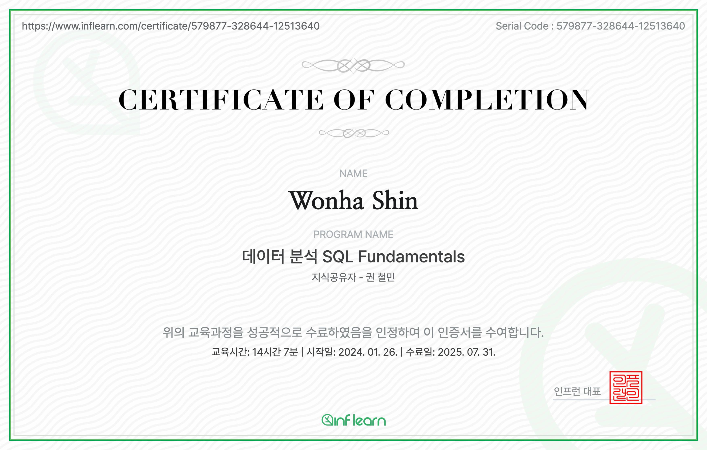

# SQL Mastery in 3 Weeks — From Fundamentals to Analytic SQL

Over the past 3 weeks, I immersed myself in the [SQL Fundamentals for Data Analysis](https://www.inflearn.com/course/데이터분석-sql-펀더멘탈) course using PostgreSQL. Though I’ve used SQL in the past and also taken a course from Udemy, this time I focused on writing **clear, optimized, and analysis-ready SQL** ***for realistic use cases: dashboards, ML pipelines, and data validation.***

Here’s what I learned (and practiced hands-on!) from the course, distilled for future reference.

### Section 1–3: Relational Joins and Data Modeling

- **Revisited the mechanics of `INNER`, `LEFT`, `RIGHT`, and `FULL OUTER` joins**
  - Example: Joining `orders` with `customers` to create a complete order-customer view while preserving nulls
- **Practiced `CROSS JOIN` and `Non-Equi JOIN`**
  - Non-equijoins were especially useful for conditions like `age BETWEEN lower_bound AND upper_bound`
- **Learned to verify cardinality and relationships (1:1, 1:N) before joining**
  - This prevents row multiplication bugs in downstream logic.

- *Use case:* Creating dimensional joins to enrich transactional logs with customer metadata and product info for downstream ML feature engineering.

 

### Section 5: Aggregation, Pivoting, and Summarization

- **Used `GROUP BY` with standard aggregates: `COUNT`, `SUM`, `AVG`, etc.**
- **Applied `CASE WHEN` logic to create categorical summaries**
  - Example: Group sales by `CASE WHEN amount > 1000 THEN 'High' ELSE 'Low'`
- **Implemented pivot tables using conditional aggregation**
- **Practiced `ROLLUP` and `CUBE` to generate multi-level summaries**

- *Use case:* Generating customer segments and sales summaries for dashboard-level insights and feeding aggregated features into a churn prediction model.

 

### Section 6–8: Analytic SQL & Window Functions

This was the most valuable section for my work.

- **Mastered row-wise ranking using `RANK()`, `DENSE_RANK()`, `ROW_NUMBER()`**
  - Used `PARTITION BY` to compute per-customer or per-product ranks
- **Calculated moving averages using `ROWS BETWEEN` and `RANGE BETWEEN`**
  - Example: 7-day rolling average of daily transactions
- **Applied `LEAD()` and `LAG()` to compare previous vs. current row values**
  - Especially useful for time-series difference features
- **Used `FIRST_VALUE()` and `LAST_VALUE()` to extract cohort-level metrics**
- **Practiced percentile functions like `NTILE()`, `PERCENTILE_DISC()`**

-  *Use case:* Building temporal features like rank-based customer loyalty levels, lag-based trend indicators, and moving-average smoothing for model inputs.

 

### Section 4: Date, Timestamp, and Time-based Analysis

- **Parsed and formatted timestamps with `TO_DATE`, `TO_CHAR`, `TO_TIMESTAMP`**
- **Extracted date components using `EXTRACT(YEAR FROM date)`**
- **Used `DATE_TRUNC` to bucket events by day/week/month**
- **Performed date arithmetic with `INTERVAL` for rolling-window analysis**

- *Use case:* Used `DATE_TRUNC('month', created_at)` to create cohort tables for retention tracking and monthly performance analysis.

 

###  Section 9: Subqueries in Depth

- **Differentiated between correlated and non-correlated subqueries**
- **Explored the tradeoffs between `IN`, `EXISTS`, and scalar subqueries**
- **Practiced scalar subqueries in `SELECT` for derived fields**
- **Understood common pitfalls with `NOT IN` vs `NOT EXISTS,` especially with NULLs**

- *Use case:* Used scalar subqueries to retrieve a user's latest purchase date directly within a SELECT block, and used `EXISTS` for efficient membership filtering in large datasets.

  

*To reinforce my understanding, I also compiled detailed SQL notes throughout the course, tracking query patterns, edge cases, and best practices. These notes include real SQL examples for scenarios like identifying top earners, handling correlated subqueries, and using analytic functions for ranking. Below are some direct excerpts from my notebook that helped me internalize core concepts through hands-on practice.*

  
