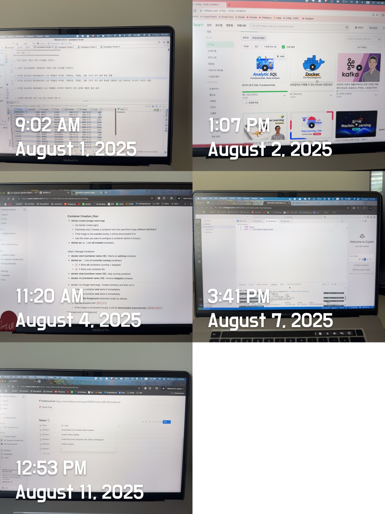

# Docker Review — From CLI Fundamentals to Multi-Container Orchestration 

Over the past week, I completed the course  Hands-On Docker: From Basics to Real-World Deployment.
While I’ve used Docker casually before, this time I focused on **end-to-end container workflows** — from basic CLI commands to deploying multi-container services on AWS EC2 — and documented every step in my Notion.

 

Throughout this intensive week, I felt a sense of **empowerment and clarity as I moved** from a scattered understanding of Docker to a confident, organized view. The course's practical approach—from CLI commands to multi-container orchestration and cloud deployment—transformed my use of Docker into a structured, workflow-focused skill. I appreciated how smoothly the course explained everything! *(from concepts like volumes and custom images to their integration in docker-compose.yml, which made managing complex stacks natural and empowering)* Deploying to AWS EC2 was a "lightbulb" moment, highlighting Docker's portability and boosting my confidence **in its practical use.**

 

Here’s what I learned and practiced hands-on.

### **Section 2–3: Docker CLI & Container Lifecycle**

- Listed, created, started, stopped, and removed containers with `docker create`, `docker run`, `docker ps`, `docker stop`, `docker rm`
- Understood **foreground vs. background** execution modes and when to use each
- Mapped **host ports to container ports** with `-p host:container` for service access
- Used `--name` for easier container management instead of container IDs
- Checked container logs (`docker logs -f --tail`) and connected inside running containers with `docker exec -it`
- *Use case*: Running Nginx in the background with `docker run -d -p 4000:80 nginx` and instantly testing from the host browser.

 

### **Section 4: Volumes & Data Persistence**

- Created **named volumes** to persist container data beyond container lifecycle
- Used bind mounts to sync local development files into containers
- Verified volume mounts in `docker inspect`
-  *Use case*: Preserving MySQL data between container restarts for local development and testing.

 

### **Section 5: Building Custom Images**

- Wrote `Dockerfile` to package a Spring Boot JAR into a container
- Understood build context, image layers, and caching for optimization
- *Use case*: Created a reusable Spring Boot image for deployment across multiple environments.

 

### **Section 6–7: Docker Compose for Multi-Container Management**

- Defined multiple services (Spring Boot + MySQL, later adding Redis) in `docker-compose.yml`
- Used **service names** as hostnames for container-to-container communication (instead of `localhost`)
- Configured `depends_on` with `healthcheck` to ensure service readiness before startup
- Managed full-stack environments with a single command: `docker compose up -d --build`
- *Use case*: Built and ran Spring Boot + MySQL + Redis stack with persistent storage, port mapping, and service dependencies.

 

### **Section 8–9: Deploying to AWS EC2**

- Installed Docker & Docker Compose on EC2
- Deployed multi-container apps to the cloud using the same local `docker-compose.yml`
- Verified external accessibility via public EC2 IP + exposed ports
- *Use case*: Hosting my Spring Boot app with MySQL backend on AWS for remote testing.

 

### **Key Lessons Learned**

- Containers are **isolated environments** — `localhost` inside a container refers only to itself.
- Use **service names** for inter-container communication in Compose.
- Volumes are essential for persistent, stateful services.
- Health checks improve reliability in multi-service setups.
- One Compose file can define an **entire application stack** from local dev to production.

 

### 📒 My Docker Notes

I compiled all commands, configurations, and troubleshooting steps in Notion for quick reference:

  
  <a href="https://www.notion.so/Docker-244e7805c3c4814a91e5dc94374e75e7">  <I>🔗 Docker Study Notes: Visit Here! </I></a>  

These notes include:

- CLI command cheatsheets
- Example `Dockerfile` and `docker-compose.yml` setups
- Port mapping & volume management tips
- Debugging container networking issues 

 

<I>Examples are provided below...</I>

  
