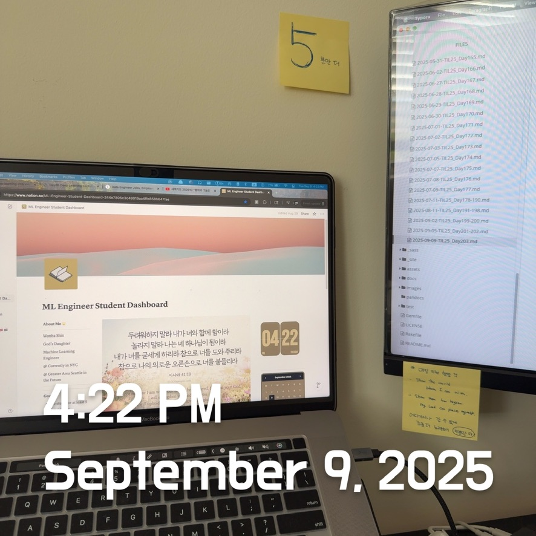

# Python 175: TwoSums / SQL: Inner Join Revisiting / DL Review: Embedding Layers



<br><br>

## 🟩 Python Review

As it had been a long time since I reviewed Python, I decided to go through the code line by line. I wrote out each line myself, checked the output, and then updated it step by step by comparing it with the solution. This hands-on approach not only helped me refresh my syntax but also provided a deeper understanding of how each part of the code works.

#### Two Sum

- Given an array of integers `nums` and an integer `target`, return the *indices of the two numbers such that they add up to `target`*
- You may assume that each input would have **exactly one solution**, and you may not use the *same* element twice.
- You can return the answer in any order.

```python
### Solution with my comments

class Solution(object):
    def twoSum(self, nums: List[int], target: int) -> List[int]:
        for i in range(len(nums)):
            for j in range (i + 1, len(nums)):
                if nums[j] == target - nums[i]:
                    return [i, j]
        # Retrun an empty list if no solution is found
        return []

        """
        --> Goes to the type definitions
        :type nums: List[int]
        :type target: int
        :rtype: List[int]
        """
        

"""
- Put constraints
- Randomly select numbers in "nums" and "target"


--- Before input J ==> Not yet entered
-10^9 <= nums[i] <= 10^9
2 <= len(nums) <= 10^4

--- 3rd try
return target = nums[i] + nums[j] ?


"""
```

- Return type: (`nums: List[int]`, `target: int`) -> `List[int]`-

- `for j in range(i + 1, len(nums)):`Nested loop that starts from `i+1` to avoid reusing the same element twice.

  <br><Br>

## 🟨 SQL Review

```sql
-- Retrieve employee information along with the department name they belong to
select a.*, b.dname
from emp a
	join dept b on a.deptno = b.deptno;

-- Retrieve information about employees whose job is SALESMAN, along with their department name
select a.*, b.dname 
from emp a
	join dept b on a.deptno = b.deptno
where a.job = 'SALESMAN';

select * from emp_salary_hist;
select * from emp;

-- Retrieve department name, employee number, employee name, job, and past salary history 
-- for employees belonging to the SALES and RESEARCH departments
select c.dname, a.empno, a.ename, a.job, b.sal, b.fromdate, b.todate
from emp a
	join emp_salary_hist b on a.empno = b.empno 
	join dept c on a.deptno = c.deptno 
where c.dname in ('SALES', 'RESEARCH')
order by c.dname, a.ename, b.fromdate;


-- Retrieve department name, employee number, employee name, job, and past salary history 
-- for employees in SALES and RESEARCH departments, 
-- but ignore records dated before 1983
select c.dname, a.empno, a.ename, a.job, b.sal, b.fromdate, b.todate
from emp a
	join emp_salary_hist b on a.empno = b.empno 
	join dept c on a.deptno = c.deptno 
where c.dname in ('SALES', 'RESEARCH')
and b.fromdate > to_date('19830101', 'yyyymmdd')
order by c.dname, a.ename, b.fromdate;


-- Calculate the average salary across all past to present salaries 
-- for each employee in SALES and RESEARCH departments
with 
temp_01 as
(
select a.dname, b.empno, b.ename, b.job, c.fromdate, c.todate, c.sal 
from hr.dept a
	join hr.emp b on a.deptno = b.deptno
	join hr.emp_salary_hist c on b.empno = c.empno
where  a.dname in('SALES', 'RESEARCH')
order by a.dname, b.empno, c.fromdate
)
select empno, max(ename) as ename, avg(sal) as avg_sal
from temp_01
group by empno;

-- Retrieve past department affiliation information for employee named SMITH
select b.ename, a.deptno, a.dname, c.fromdate, c.todate
from hr.dept a
	join hr.emp b on a.deptno = b.deptno
	join hr.emp_dept_hist c on b.empno = c.empno 
where ename = 'SMITH';


-- Retrieve order information (order ID, order date, shipped date, ship address) 
-- along with customer address for orders placed in 1997 by customer 'Antonio Moreno'
select b.order_id, b.order_date, b.shipped_date, b.ship_address 
from nw.customers a 
	join nw.orders b on a.customer_id  = b.customer_id 
	join nw.order_items c on b.order_id = c.order_id 
where a.contact_name = 'Antonio Moreno'
and b.order_date between to_date('19970101', 'yyyymmdd') and to_date('19971212', 'yyyymmdd');


-- Retrieve order information for customers living in Berlin: 
-- customer name, order ID, order date, employee (who handled the order), and shipper company name
select a.contact_name, b.order_id, b.order_date, c.last_name||' '||c.first_name as employee_name, d.company_name 
from nw.customers a
	join nw.orders b on a.customer_id = b.customer_id 
	join nw.employees c on b.employee_id = c.employee_id 
	join nw.shippers d on b.ship_via = d.shipper_id 
where a.city = 'Berlin';


-- Retrieve all product IDs and names belonging to the Beverages category, 
-- along with the supplier company names
select a.product_id, a.product_name , c.company_name 
from nw.products a
	join nw.categories b on a.category_id = b.category_id  
	join nw.suppliers c on a.supplier_id = c.supplier_id 
where b.category_id = '1';
```

<Br><br>

## 🟦 DL Review: Embedding Layers

> An **embedding** maps high-dimensional categorical inputs (e.g., words, user IDs, products) <u>into dense, continuous vectors in a lower-dimensional space.</u> These vectors <u>capture semantic similarity and relationships.</u>

**Why it matters**

- **Efficiency**: Reduces dimensionality from millions (one-hot vectors) to a few hundred.
- **Representation Power**: Embedding captures semantic meaning (e.g., word2vec: "king - man" + "woman $\sim$ Queen").
- **Versatility**: Used in NLP, recommendation systems, graph embeddings, etc.

> "Embedding layer learn dense representations of categorical variables, reducing dimensionality and capturing semantic similarities. They're fundamental in NLP and recommendation systems because they transform discrete entities into **meaningful continuous spaces.** "

**MLOps Angle**

* Embeddings can drift in production if distribution shifts, such as new slang in tweets or new items in a recommender system. Monitoring embedding spaces through clustering or cosine similarity changes is essential for maintaining robust pipelines. 

<Br><Br>
