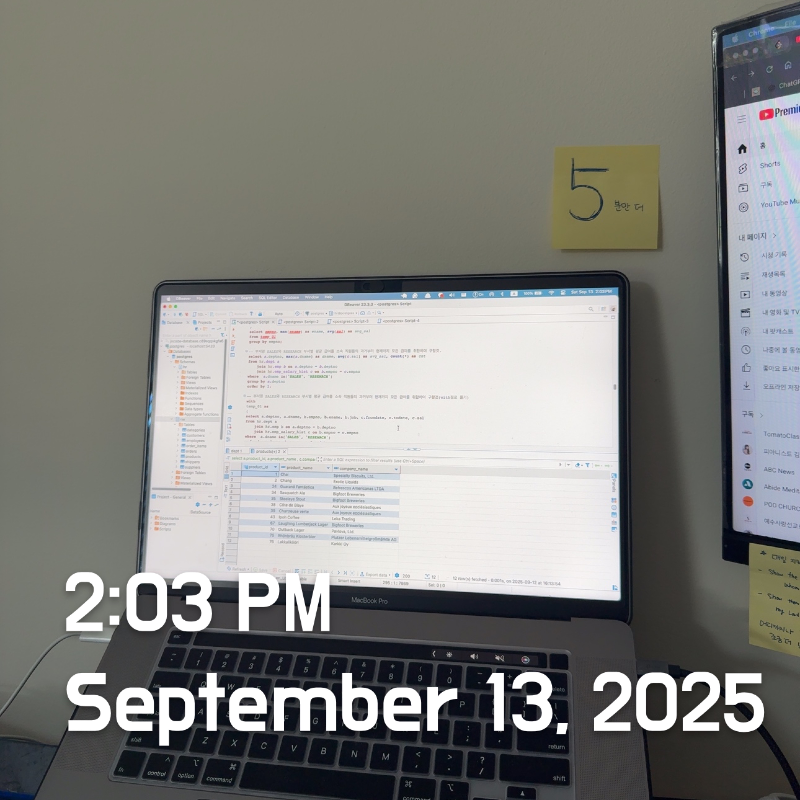

# Python 217: Contains Duplicate / SQL 175,176: Second-highest Salary / DL Review: Autoencoders, Knowledge Distillation



<br><br>

## 🟩 Python Review

### 217. Contains Duplicate

- Given an integer array `nums`, return `true` if any value appears **at least twice** in the array, and return `false` if every element is distinct.

```python
### My answer
class Solution(object):
    def containsDuplicate(self, nums: List[int] -> Bool):
        if len(nums) != sort(len(nums)) # A bit confused
        else true
        return false

        """
        :type nums: List[int]
        :rtype: bool

        ---> Check numbers of list and compare 
        """
        
### Solution 
class Solution(object):
    def containsDuplicate(self, nums: List[int]) -> bool:
        if len(nums) == len(set(nums)): # Use SET
            return False
        return True
```

From my attempt, 

- Many syntax errors. I was confused about how to compare the number of list indexes. 
- Should be `-> bool` (lowercase), not `-> Bool`.  
- I missed a colon (`:`) after the `if` statement.

From the corrected solution,

- `set(nums)` removes duplicates because a set cannot contain repeated values.
- The logic:
  - If the lengths are equal -> no duplicates; return `true`.
  - If the lengths are unequal -> duplicates exist; return `false`,

<Br>

## 🟨 SQL Review

### 175. Combine Two Tables

```sql
-- My Answer 
select a.firstName, a.lastName, b.city, b.state 
from Person a 
	outer join Address b on a.personId = b.personId;

-- Solution
SELECT a.firstName, a.lastName, b.city, b.state
FROM Person a
LEFT JOIN Address b 
    ON a.personId = b.personId;
```

In **PostgreSQL**, the `OUTER JOIN` must be specified more explicitly — you can use `LEFT JOIN`, `RIGHT JOIN`, or `FULL OUTER JOIN` depending on the requirement.

<br>

### 176. Second-Highest Salary

```sql
-- My Answer
select dist(salary) from Employee
Limit 1;
-- Do I have to use group by? ==> NO, You do not need to. 
-- Do I have to put any constraints for null value? ==> No, Postgre automatically ignores Nulls.

-- Solution
select distinct salary from Employee
order by salary desc
offset 1 limit 1;
```

From my attempt.

- `DIST ()` is not a valid function in PostgreSQL. 
  - I must write up `SELECT DISTINCT`. 
- I forgot to use `offset` to calculate the second-highest one.

From the solution,

- `offset` skips a certain number of rows. From here, we skip the first highest salary, and then provide the second highest one as requested. 

<br>

## 🟦 DL Review

### 1. Autoencoders

> Autoencoders are neural networks trained to **reconstruct their input**. They consist of:

- **Encoder**: Compresses the input <u>into a low-dimensional latent representation.</u>
- **Decoder**: <u>Reconstructs</u> the original input from the latent space.

**Why It Matters**

- **Dimensionality Reduction**: Nonlinear alternative to PCA.
- **Noise Reduction**: Denoising autoencoders can remove noise while preserving important features.
- **Representative Learning**: Latent vectors capture compressed, meaningful structure.
- **Applications**: Anomaly detection, data compression, image denoising, and as building blocks in generative models (e.g., Variational Autoencoders).

> "Autoencoders learn <u>compressed representations of data by forcing the network to <b>reconstruct </b>its own input.</u>  This enables dimensionality reduction, noise removal, and anomaly detection. They are widely used as unsupervised feature learners and as the foundation for more advanced generative models."

**MLOps Angle**

* Autoencoders are often used for **monitoring and anomaly detection pipelines** (e.g., unusual system logs or network traffic). 
* In production, retraining is needed frequently since "normal" behavior can shift over time → ties back to **concept drift detection.**

<br>

### 2. Knowledge Distillation

> Knowledge distillation is a technique in which <u>a large, complex model (the teacher) transfers its learned knowledge to a smaller, simpler model (the student).</u>

- The student is trained not only on ground-truth labels **but also on the soft outputs (probabilities/logits)** from the teacher.

**Why It Matters**

- **Model Compression:** Smaller model achieves close-to-teacher accuracy.
- **Efficiency**: Student models are faster, lighter, and suitable for deployment on edge devices.
- **Generalization**: Teacher's probability distributions capture richer information than hard labels.

> "Knowledge distillation compresses a large teacher model into a smaller student model by training the student <u>on the teacher's soft predictions.</u> This reduces inference cost and memory usage, while retaining much of the teacher's performance. It's widely used to deploy deep learning models on resource-constrained environments."

**MLOps Angle**

- In deployment, distillation is crucial for balancing **accuracy vs. latency trade-offs.**
- Distilled student models are easier to serve in **real-time production pipelines,** especially on mobile/edge devices.
- Monitoring is essential: the student may degrade faster than the teacher under **data drift**, so retraining pipelines must be in place.

<Br><Br>
