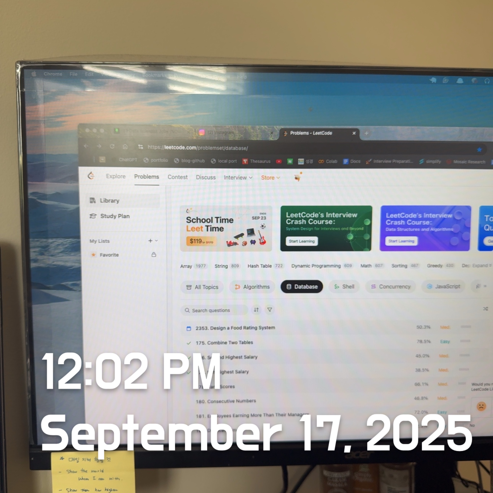
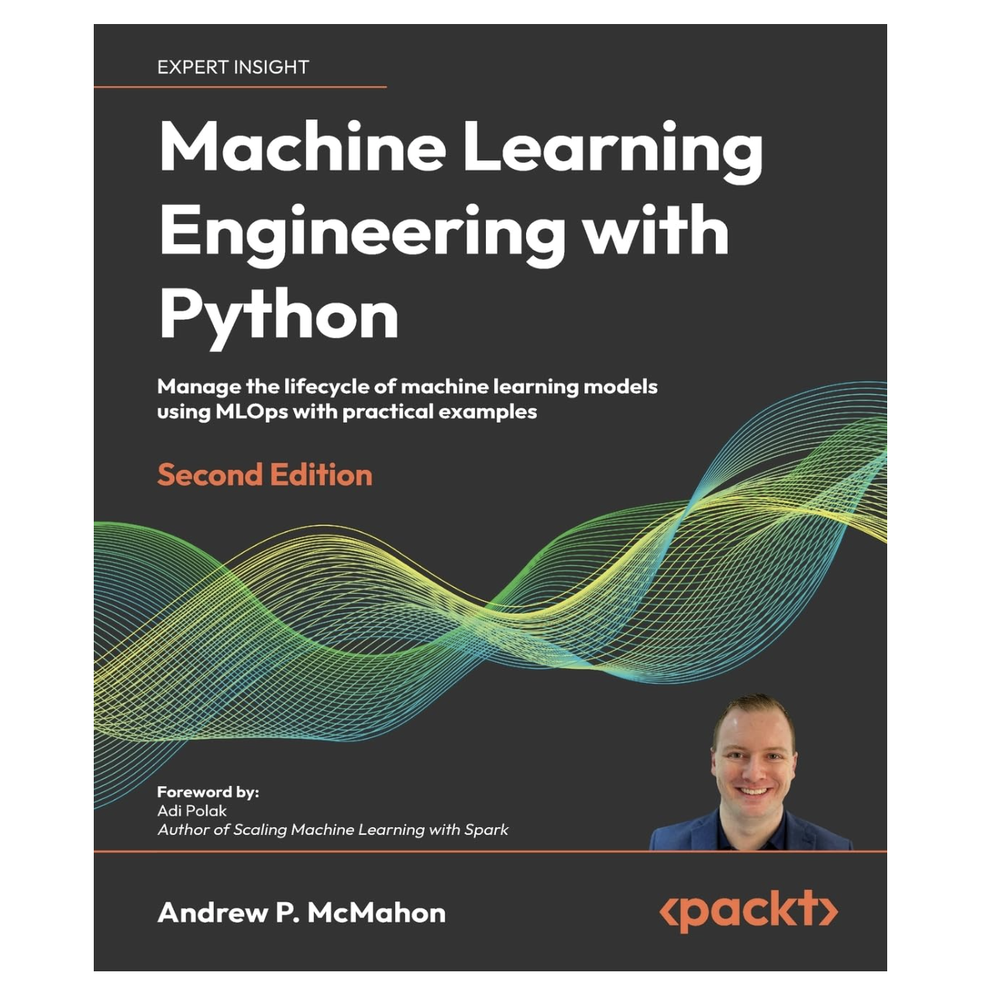
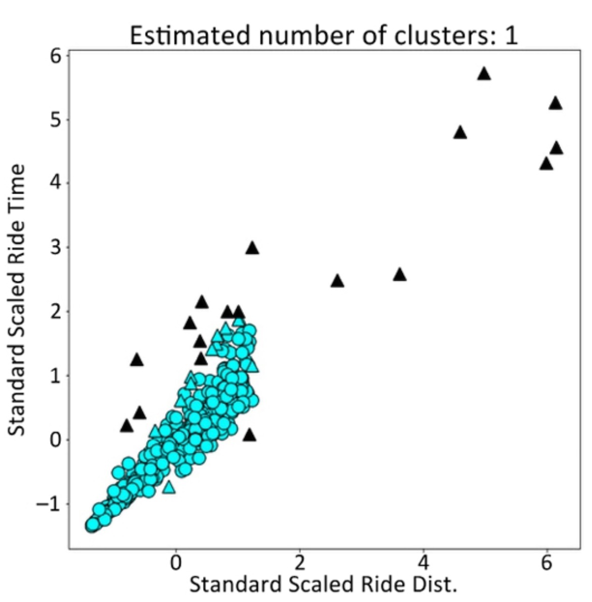

# Python 20: Valid Parentheses & ML Engineering: High-level ML System Design

<br><br>

## 🟩 Python Review

### 20. Valid Parentheses

Given a string `s` containing just the characters `'('`, `')'`, `'{'`, `'}'`, `'['` and `']'`, determine if the input string is valid.

An input string is valid if:

1. Open brackets must be closed by the same type of brackets.
2. Open brackets must be closed in the correct order.
3. Every close bracket has a corresponding open bracket of the same type.


#### Solution

You’re given a string `s` of characters:

- Only `'(' , ')' , '{' , '}' , '[' , ']'`.

Check if it is **valid**, meaning:

1. Every open bracket must be closed by the same type.
2. Brackets must close in the correct order (LIFO).
3. No unmatched closing bracket.

<br>

**Concepts**

**1. Naïve Approach**

Try all (`buy, sell`) pairs → `0(n^2)` time. It is too slow for large inputs.

**2. Key Observation**

- Profit = `sell_price - buy_price`.
- To maximize profit, we need **to buy the lowest before selling the largest.**
  - The **minimum prices so far** (best day to buy thus far).
  - The **maximum profit so far** if it is sold today.

**3. Greedy One-Pass Algorithm**

Each day:

- `min_price = min(min_price, price[i])`
- `profit = price[i] - min_price`
- `max_profit = max(max_profit, profit)`

**Solution Code**

```python
from typing import List

class Solution:
    def maxProfit(self, prices: List[int]) -> int:
        min_price = float('inf')
        max_profit = 0
        for price in prices:
            if price < min_price:
                min_price = price       # update buying day
            else:
                max_profit = max(max_profit, price - min_price)
        return max_profit
```

- Only **one pass** is needed: `O(n)` time, `O(1)` space.
- Greedy works because the best profit depends solely on the lowest seen price before the current day.

<Br>

## 🟧 MLOps Review

<center>
  <br><br>
</center>

*I will begin reviewing the book: [Machine Learning Engineering with Python by Andrew P. McMahon](https://www.amazon.com/Machine-Learning-Engineering-Python-lifecycle/dp/1837631964/ref=sr_1_1?crid=1420CWRGG6I0C&dib=eyJ2IjoiMSJ9.rpSXmTLugti6EncvKZf5rBgDU6GTAplPUshap0xdT_Jja3LAGACAHO-Phn8krrm2oEesyalt6Qq0XBKOq1vOFpL04UCV4A-8CIm8y6psyPhixJBgJpkwW4D-1DpGvAxtekU0YLmiLc8oOtgWJFIUXGcuDoZjEIqz8fu_EXml6GYjKOC93VHV4VOuTPR4GkVDxOJ-KBvwh39rvtVyoFvc7r3x6pf5p5pWtPXG2sZ6nLg.VHR-Va7IvCRSW4JGHbq5vW7G13aO-yMIzM2MB1LkdeU&dib_tag=se&keywords=machine+learning+engineering&qid=1758222072&sprefix=machine+learning+engineering%2Caps%2C147&sr=8-1). This practical guide helps turn machine learning projects into successful deployments by building and scaling solutions that address real-world problems. It also includes a new chapter on generative AI and large language models (LLMs), covering the building of a pipeline that utilizes LLMs with LangChain. I hope to gain hands-on knowledge through exercises in this book.*

### High-Level ML System Design

Typically, ML engineering in the real world encompasses a range of diverse structures and objectives. Let's go through some examples where a team needs to design a high-level ML system for common business problems. 

#### Example: Batch Anomaly Detection Service

Suppose you work for a taxi company with thousands of cars. The company aims to make ride times more consistent and analyze longer journeys to enhance customer experience, increase retention, and encourage repeat business. Your ML team is tasked with developing an anomaly detection service to spot rides with unusual duration or length behaviors. If the plot looks like this, what should we do? 

<center>
  <br><Br>
</center>

We can agree that running this daily could yield enough data for profound insights. Then, **how will you schedule that run?** Here, you will need an orchestration layer, which is a tool or set of tools that enable you to plan and manage predefined jobs. **A tool like Apache Airflow would do exactly like this.**  

> **What do you do next**? Since runs are daily and data volume is high, leveraging distributed computing makes sense. Two options are familiar: Apache Spark and Ray. <u>To minimize infrastructure dependencies and refactoring, you choose <b>Ray.</b></u> The data's endpoint is a SQL database table, so <u>you coordinate with the database team to plan data handover</u>. For security and reliability, <u>direct writes to the production database are avoided.</u> Instead, a <b>cloud</b> database serves as an intermediate staging area for daily queries.

The example flow highlights the ML design process. It may appear cluttered, but it is not. Let's fill the gaps one step at a time.

<br>


